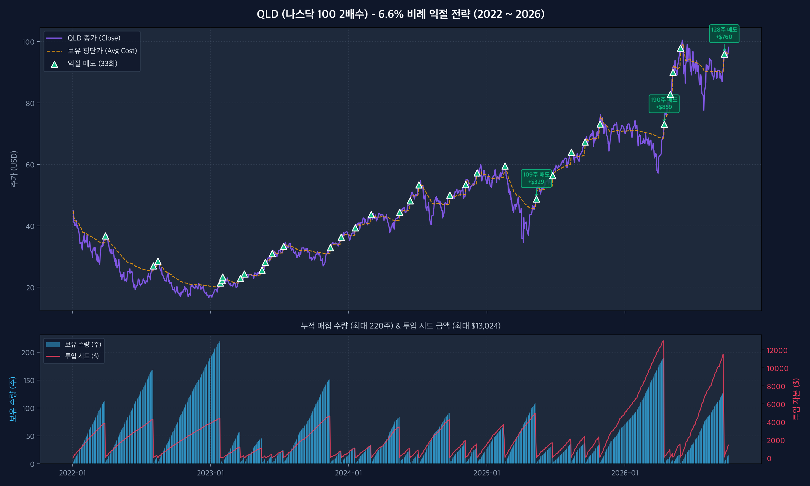
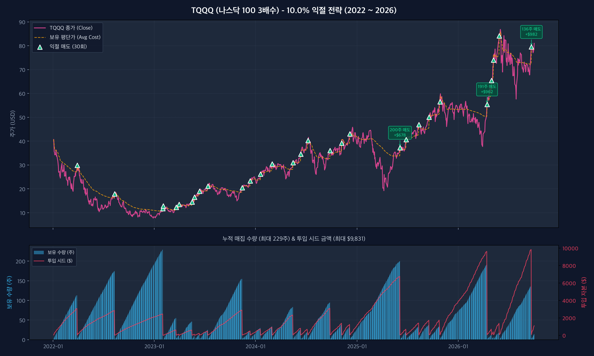
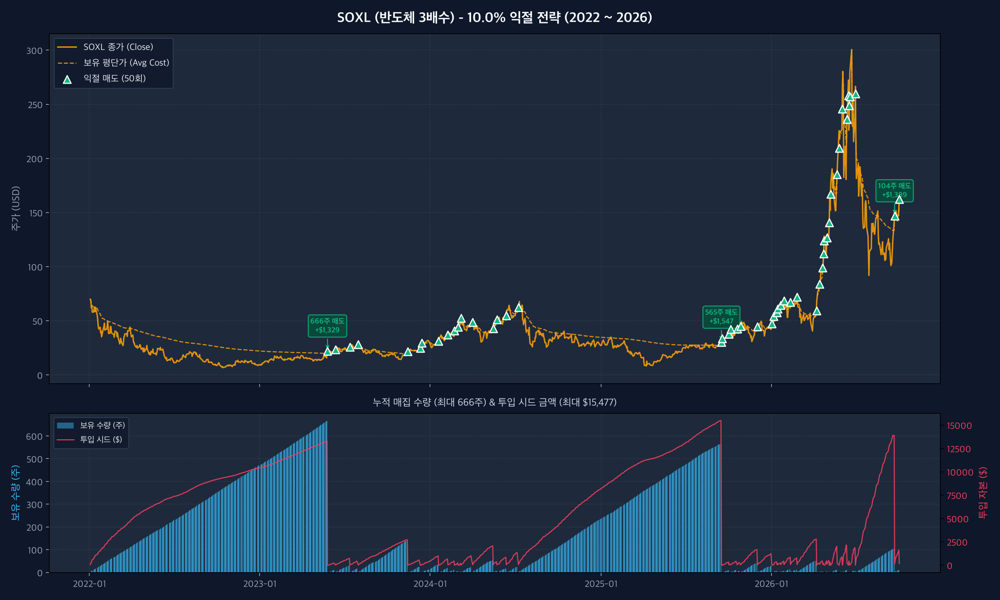
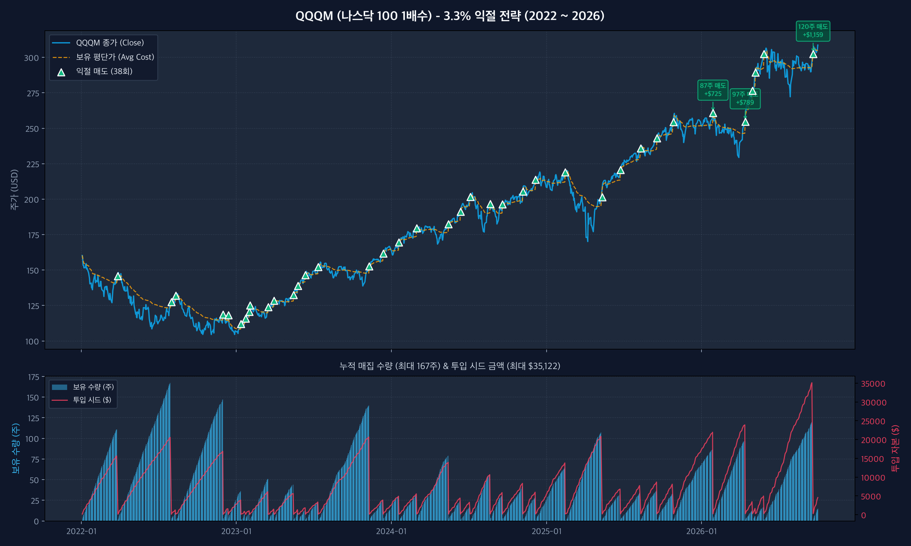

# 📈 Toss Bot 백테스팅 리포트 & 시뮬레이터

토스증권 해외주식 자동매매 봇의 **LOC 2분할 매수 + 목표 익절가 지정가 매도 전략**에 대한 종목별/배수별 백테스팅 비교 리포트 및 시각화 차트입니다.

---

## 📌 나스닥 배수별 비례 익절 목표 산정 로직

기초 지수인 **나스닥 100 지수가 약 +3.3% 반등**할 때를 기준으로 각 ETF 배수별로 수학적으로 비례하는 익절 목표를 설정합니다:

* **1배수 (QQQ, QQQM)**: 지수 +3.3% × 1 = **+3.3% 익절**
* **2배수 (QLD)**: 지수 +3.3% × 2 = **+6.6% 익절** *(비교용 5.0% 세팅 포함)*
* **3배수 (TQQQ)**: 지수 +3.3% × 3 = **+9.9% (약 10.0% 익절)**

---

## 📊 1. 2022년 ~ 2026년 장기 백테스팅 (4년 10개월 스트레스 테스트)

> **테스트 기간**: `2022-01-03` ~ `2026-10-02` (총 1,192 거래일, 2022년 대폭락장 포함)

### 🏆 전체 종목 비례 익절 종합 비교표

| 종목 | 배수 & 익절목표 | 총 익절 | 총 실현 손익 | 최대 필요 시드 (Max Seed) | 최대 누적 | 시드대비 수익률 (ROI) | 평가 및 특징 |
| :--- | :---: | :---: | :---: | :---: | :---: | :---: | :--- |
| **QQQ** | 1배수 (**+3.3%**) | 38회 | **+$26,590.13** | $86,858 (약 1억 1,900만원) | 166주 | 30.76% | 주당 $500대로 시드 부담 매우 큼 |
| **QQQM** | 1배수 미니 (**+3.3%**) | 38회 | **+$10,834.83** | $35,122 (약 4,800만원) | 167주 | 31.29% | **1배수 중 시드 절약형 (QQQ 대비 60% 절약)** |
| **QLD (6.6%)** | 2배수 비례 (**+6.6%**) | 33회 | **+$5,469.09** | $13,024 (약 1,780만원) | 220주 | **42.23%** | **수학적 정비례 세팅, 균형 잡힌 수익** |
| *QLD (5.0%)* | *2배수 가성비 (+5.0%)* | *48회* | *+$4,194.32* | *$6,509 (약 890만원)* | *221주* | *64.91%* | *소액 시드(890만원) & 최다 익절 회전형* |
| **TQQQ** | 3배수 (**+10.0%**) | 30회 | **+$5,953.43** | $9,831 (약 1,350만원) | 229주 | **60.91%** | 3배수 레버리지 효과로 높은 자본 효율 |
| **SOXL** | 3배수 반도체 (**+10.0%**) | 50회 | **+$7,740.94** | $15,477 (약 2,120만원) | 666주 | 50.02% | **최대 달러 수익금**, 2022년 666주 매집 탈출 |

---

## 📈 2. 종목별 주가 & 익절 매도 구간 시각화 차트

> 차트 상단의 **초록색 삼각형(▲)**은 평단가 대비 목표 익절률에 도달하여 **보유 물량을 전량 매도한 시점**입니다.  
> 하단 차트는 **보유 수량(막대)**과 **투입 시드 금액(빨간 선)**의 변화로, 익절 시 정확히 0으로 리셋되어 현금화되는 사이클을 보여줍니다.

### ① QLD (2배수 / +6.6% 비례 익절)


### ② TQQQ (3배수 / +10.0% 익절)


### ③ SOXL (3배수 반도체 / +10.0% 익절)


### ④ QQQM (1배수 미니 / +3.3% 익절)


---

## 📊 3. 2026년 올해(YTD) 백테스팅 결과

> **테스트 기간**: `2026-01-02` ~ `2026-10-02` (총 189 거래일)

| 종목 | 배수 & 익절목표 | 익절 횟수 | 실현 손익 | 연중 최대 시드 | 시드대비 수익률 |
| :--- | :---: | :---: | :---: | :---: | :---: |
| **QQQ** | 1배수 (+3.3%) | 5회 | +$5,927.57 | $86,747 (122주) | 6.98% |
| **QQQM** | 1배수 미니 (+3.3%) | 5회 | +$2,450.18 | $35,122 (120주) | 7.13% |
| **QLD** | 2배수 (+6.6%) | 5회 | +$1,491.10 | $11,514 (128주) | 13.22% |
| *QLD* | *2배수 (+5.0%)* | *8회* | *+$1,133.53* | *$8,005 (119주)* | *14.54%* |
| **TQQQ** | 3배수 (+10.0%) | 5회 | +$1,817.31 | $9,831 (136주) | 18.84% |
| **SOXL** | 3배수 (+10.0%) | 25회 | +$3,154.07 | $13,883 (104주) | 22.72% |

---

## 🛠️ 실행 방법 (Usage)

```bash
# 차트 이미지 전체 재생성
python generate_charts.py

# 브라우저 인터랙티브 뷰어 열기
open charts_viewer.html

# 전체 종목 비교 및 JSON 결과 갱신
python compare_all.py
```
